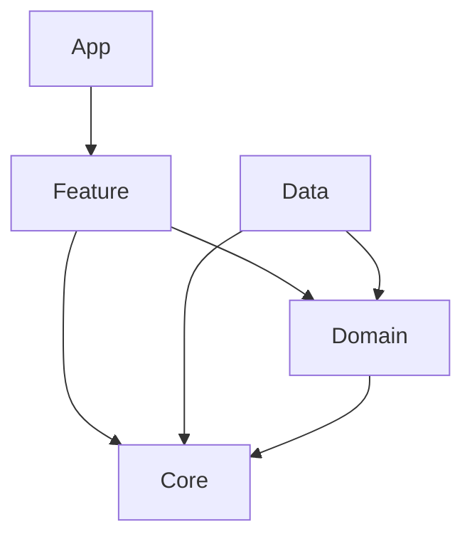

## configuration

```mermaid
graph TD
    App --> Feature
    Feature --> Domain
    Feature --> Core
    Data --> Domain
    Data --> Core
    Domain --> Core
```

- Feature
  - View, ViewModel
- Data
  - Repository, Client
- Domain
  - ~Protocol, UseCase
- Core
  - Entities, Extension, Error define

